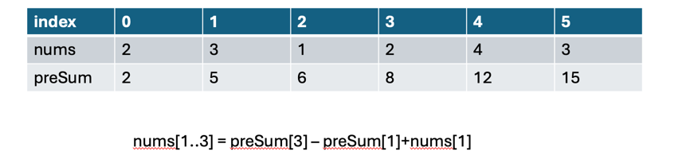
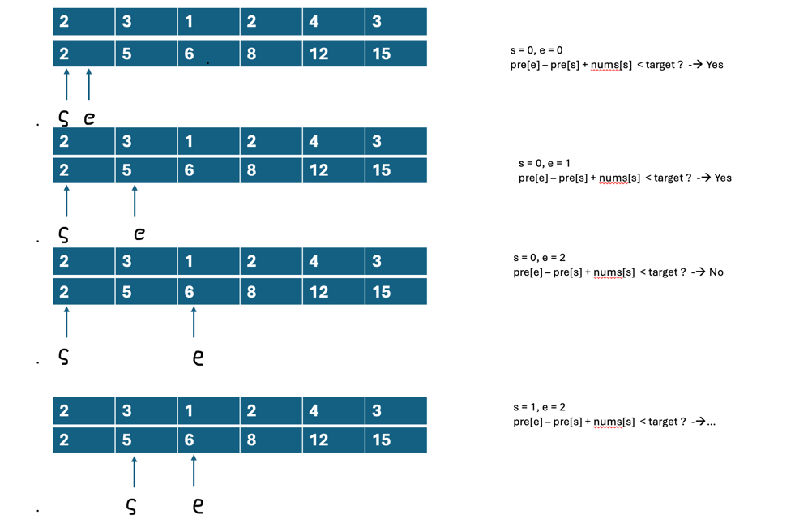

# LC 209 Minimum Size Subarray Sum
- 前缀和
  - 无须数组构造有序数组
- 二分查找
- 滑动窗口
## 问题描述
Given an array of positive integers nums and a positive integer target, return the minimal length of a
subarray
whose sum is greater than or equal to target. If there is no such subarray, return 0 instead.

```text
Example 1:
Input: target = 7, nums = [2,3,1,2,4,3]
Output: 2
Explanation: The subarray [4,3] has the minimal length under the problem constraint.

Example 2:
Input: target = 4, nums = [1,4,4]
Output: 1

Example 3:
Input: target = 11, nums = [1,1,1,1,1,1,1,1]
Output: 0
```
- nums数组均为正数
- subarray需要连续
- subarray >= target的最小长度
- target范围[1,10^9]
- nums数组长度[1,10^5]
- nums[i]内容范围[1,10^4]

## 分析
- 输入输出是一个无序数组，二分解决时需要先排序
- 子序列和问题，想到前缀和，将前缀和处理到另一个数组preSum中，二分再对preSum和nums操作

  
## 题解
### 方法一：前缀和+二分
```java
/**
* 方法二：前缀和+二分 O(nlogn) 5.88%
* */
public static int minSubArrayLen_2(int target, int[] nums) {
        int n = nums.length;
        int[] preSum = new int[n];
        int res = Integer.MAX_VALUE;

        // 构造preSum
        // preSum[i]表示 nums[0...i]的和
        preSum[0] = nums[0];
        for(int i=1;i<n;i++)
            preSum[i] = preSum[i-1]+nums[i];

//        for(int s:preSum)
//            System.out.print(s+" ");
//        System.out.println();

        // 对nums中的每个位置进行遍历，作为start
        for(int i=0;i<n;i++) {
            int t = target + preSum[i] - nums[i];

            // 对i之后的位置进行二分
            int left = i, right = n-1;
            while(left < right) {
                int mid = left + right >> 1;
                if(preSum[mid] >= t) {
                    // 右区间的左边界
                    right = mid;
                } else
                    left = mid + 1;
            }

            if(preSum[left] >= t)  // 找不到元素则不更新
                res = Math.min(res, left-i+1);
        }
        return res==Integer.MAX_VALUE ? 0: res;
    }
```
- 时间复杂度O(nlogn) 5.88%
- 空间复杂度O(n)

时间复杂度过高了，只击败了5.88%. 而且这里实际编写的时候有一些注意点：
- 更新res的时候不能直接更新，有可能最后的left其实不满足check, 也就是没找到目标元素，
但在这份模板中，left不会越界，所以需要再用check(left)判断一下，最后找到的left是不是满足
  条件。
  
- 最后return的时候，由于我们一开始将res设置为了MAX_NUM, 不能直接返回。如果res一次都没有被
更新过，那么需要返回0.

### 方法二：滑动窗口


滑动窗口的移动策略:
- 对nums和preSum进行操作
- 初始值start = end = 0, 将start和end理解为nums[start...end]这一段数据的和。
即cur = preSum[end]-preSum[start]+nums[start]
- 如果cur大于target, 说明我们可以舍弃一些元素，那么将start++
- 如果cur小于target, 说明我们还需要更多的元素进入队列，end++

```java
/**
* Method 1: 双指针，O(N) 99.74%
* */
public static int minSubArrayLen(int target, int[] nums) {
        int[] dp = new int[nums.length];
        dp[0] = nums[0];

        // 构造前缀和数组
        for(int i = 1;i<nums.length;i++)
            dp[i] = dp[i-1] + nums[i];

        int res = Integer.MAX_VALUE;

        int start = 0, end = 0;
        while(start < nums.length && end < nums.length) {
            if(dp[end] - dp[start] + nums[start] >= target) {
                res = Math.min(res, end-start+1);
                ++start;
            } else
                ++end;
        }

        // 判断res是否被更新过
        return res == Integer.MAX_VALUE ? 0 : res;
    }
```
- 时间复杂度O(n)
- 空间复杂度O(n)