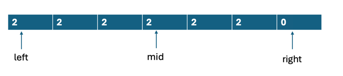

# LC 275 H-Index II

## 问题描述

### Input and Output
Given an array of integers citations where citations[i] is the number of citations a researcher received for their ith paper and citations is sorted in **ascending order**, return the researcher's h-index.

According to the definition of h-index on Wikipedia: The h-index is defined as the maximum value of h such that the given researcher has published at least h papers that have each been cited at least h times.

You must write an algorithm that runs in logarithmic time.

```text
Example 1:
Input: citations = [0,1,3,5,6]
Output: 3
Explanation: [0,1,3,5,6] means the researcher has 5 papers in total and each of them had received 0, 1, 3, 5, 6 citations respectively.
Since the researcher has 3 papers with at least 3 citations each and the remaining two with no more than 3 citations each, their h-index is 3.

Example 2:
Input: citations = [1,2,100]
Output: 2
```

## 分析
- 至少有h篇的引用数量大于等于h，找到这个最大的h
- 数组是严格升序的，下标i代表引用次数
- citations数组长度[1,10^5]
- citations数组内容范围[0,1000]
- 数组是有序的，考虑二分


以[0,1,3,5,6]这个输入为例，表示这个作者有5篇论文，它们的引用分别为0,1,3,5,6。
- 当h=2时，citations数组中>=2的元素个数有[3,5,6],满足4 >= h;
- 当h=3时，citations数组中>=3的元素个数有[3,5,6]，满足3 >= h;
- 当h=4时，citations数组中>=4的元素个数是[5,6], 2 < h, 不满足。

由于h要尽可能大，所以h为3。注意我们每次都是通过枚举h，结合citations数组中大于h的引用篇数进行比较。


这个题目的解题关键是要捋清楚这个>=citations[i]的篇数数组，构造check()时用得到。总结一下二分编写时候的步骤：
- 确定二分搜索范围 [0, n]
- 明确左边界or右边界问题
  - 如图所示，此题找的是右区间的左边界
- 构造check函数
- 套用模板

## 题解
### 方法一：二分法
```java
public static int hIndex_5(int[] citations) {
        int n = citations.length;

        // 明确搜索范围为[0,n]
        int left = 0, right = n;

        while(left < right) {
            int mid = left + right + 1>> 1;
            // 注意这里index是n-mid
            if(citations[n-mid] >= mid) {
                // 左区间，mid趋向左，check条件满足
                left = mid;
            } else
                right = mid - 1;
        }
        return left;
    }
```
- 时间复杂度O(logn)
- 空间复杂度O(1)

#### 方法二：直接倒序查找

依旧是这个图，也可以不用二分找，直接从后面倒序遍历即可。
```java
/**
* 方法三：优化，从后向前遍历，更新可能的h
* O(n) 100%
* */
public static int hIndex_3(int[] citations) {
    int n = citations.length;
    int res = 0;
        
    for(int i=n-1;i>=0;--i) {
        if(citations[i] >= n-i) {
            res = n-i; // update h
        } else
            break;
    }

        return res;
}
```
- 时间复杂度O(n)
- 空间复杂度O(1)