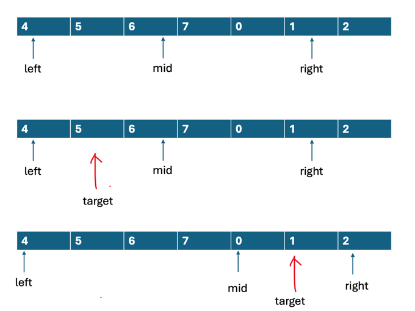

# Search in Rotated Sorted Array
- LC33 Search in Rotated Sorted Array (medium)
- LC81 Search in Rotated Sorted Array II (medium)
- LC153 Find Minimum in Rotated Sorted Array (medium)
- LC154 Find Minimum in Rotated Sorted Array II (hard)
- LC162 Find Peak Element (medium)

## LC33 Search in Rotated Sorted Array
### 问题描述
There is an integer array nums sorted in **ascending** order (with distinct values).

Prior to being passed to your function, nums is possibly rotated at an unknown pivot index k (1 <= k < nums.length) such that the resulting array is [nums[k], nums[k+1], ..., nums[n-1], nums[0], nums[1], ..., nums[k-1]] (0-indexed). For example, [0,1,2,4,5,6,7] might be rotated at pivot index 3 and become [4,5,6,7,0,1,2].

Given the array nums after the possible rotation and an integer target, return the index of target if it is in nums, or -1 if it is not in nums.

You must write an algorithm with O(log n) runtime complexity.

```text
Example 1:
Input: nums = [4,5,6,7,0,1,2], target = 0
Output: 4

Example 2:
Input: nums = [4,5,6,7,0,1,2], target = 3
Output: -1

Example 3:
Input: nums = [1], target = 0
Output: -1
```

### 分析
- 没有重复元素
- 数组旋转以后，分成了两部分分别有序的子数组
- 要求时间复杂度为O(logn)

这类旋转的题目，需要分情况讨论，mid落入数组，要么落入严格有序的部分，要不落入disorder的部分。如果落入有序部分，
对于两个不同的部分，根据target和mid, left, right的大小关系，判断target在mid的左边还是右边，从而更新left和
right指针。

判断有序只需要利用**nums[mid] > nums[left]**即可，满足这个条件，即落入有序部分。



- 当nums[mid] >= nums[left], 说明此时的mid落入严格有序的部分
  - 如果nums[left] <= target <= nums[mid], 说明target在mid左边，往左边继续找
  - 否则，target在mid右边，往右边找  

- 当nums[mid] < nums[left], 说明此时mid落入无序的部分
  - 如果nums[mid] <= target <= nums[right], 说明target在mid右边，往右边找
  - 否则，target在mid左边，往左边找
    
以上就是rotate数组查找的关键步骤，check条件写的都是找严格有序部分。

### 题解
```java
/**
* 20240615
* [4,5,6,7,0,1,2]
* 1.关键在于判断mid落入哪个区间，纯有序还是右边的无序
* 2.每次可以排除一半元素，这是二分法的精髓
* 3.这一题的元素是unique的
* */
public static int search_4(int[] nums, int target) {
        int n = nums.length;

        int left = 0, right = n-1;
        while(left < right) {
            int mid = left+right >> 1;
            if(nums[mid] >= nums[left]) {
                // 落入有序区间
                if(nums[left] <= target && target <= nums[mid]) {
                    // 落入mid的左边
                    right = mid;
                } else
                    left = mid + 1;
            } else {
                // 落入无序区间
                if(target >= nums[mid] && target <= nums[right]) {
                    // 落入mid的右边
                    left = mid;
                } else
                    right = mid-1;
            }
        }
        return nums[left] == target ? left:-1;
    }
```
- 时间复杂度O(logn)
- 空间复杂度O(1)

## LC81 Search in Rotated Sorted Array II
### 分析
如果是有重复元素的数组，如何处理？Leetcode 81题和Leetcode 31题解法基本一样，但是81题含有重复数字。
比如对于[3,3,4,5,0,1,2,3,3,3], 无法再根据nums[mid] >= nums[left]断定mid一定落入左半部分了，在
有重复数字的情况下，比如nums[mid] == 3时，mid可能落入的是有序的左边，或者是右边。

当nums[mid] > 3时，mid还是只可能落入左边有序部分，nums[mid] < 3时，mid只可能落入右边部分。

经过分析发现，我们只要在一开始的时候将nums[left]==nums[right]的情况预处理即可。

### 题解
```java
/**
* 方法一：二分法
* 和33题类似，但有重复元素
* [2,2,2,3,0,1,2]
* 如果首尾出现相同的元素，会给判断左右部分造成困扰
* 比如nums[mid] >= nums[start]，并不能表示mid出现在左部分
* 解决方案：在二分循环中做一些处理，每次二分之前都移动left和right指针略过重复元素
* */
public static boolean search(int[] nums, int target) {
        int left = 0, right = nums.length-1;

        while(left < right) {
            // 只有这一步和33题不一样
            while(left < right && nums[left] == nums[right]) --right; 
            // [2,3,4,0,1]
            int mid = left + right >> 1;
            //System.out.println("left="+left+" right="+right+" mid="+mid);

            if(nums[mid] >= nums[left]) {
                // 落入左半边有序部分
                if(nums[left] <= target && target <= nums[mid])
                    right = mid;
                else
                    left = mid + 1;
            } else {
                // 落入右半边
                if(nums[mid] <= target && target <= nums[right])
                    left = mid;
                else
                    right = mid - 1;
            }
        }
        return nums[left] == target;
    }
```
- 时间复杂度O(n)
- 空间复杂度O(1)

## LC 153 Find Minimum in Rotated Sorted Array
### 问题描述
Suppose an array of length n sorted in ascending order is rotated between 1 and n times. For example, the array nums = [0,1,2,4,5,6,7] might become:

[4,5,6,7,0,1,2] if it was rotated 4 times.
[0,1,2,4,5,6,7] if it was rotated 7 times.
Notice that rotating an array [a[0], a[1], a[2], ..., a[n-1]] 1 time results in the array [a[n-1], a[0], a[1], a[2], ..., a[n-2]].

Given the sorted rotated array nums of unique elements, return the minimum element of this array.

You must write an algorithm that runs in O(log n) time.

```text
Example 1:
Input: nums = [3,4,5,1,2]
Output: 1
Explanation: The original array was [1,2,3,4,5] rotated 3 times.

Example 2:
Input: nums = [4,5,6,7,0,1,2]
Output: 0
Explanation: The original array was [0,1,2,4,5,6,7] and it was rotated 4 times.

Example 3:
Input: nums = [11,13,15,17]
Output: 11
Explanation: The original array was [11,13,15,17] and it was rotated 4 times. 
```

### 分析
- 数组是rotate的，不含重复元素
- 特殊case，考虑[1,3,4,6]这种严格递增序列
- 数组长度[1,5000]
- 数组内容范围[-5000,5000]

这题的关键是找到无序部分开始的位置。有序部分的条件很好判断，nums[mid] > nums[left]即落入有序区间。
相当于这个check找的是左区间的右端点，离我们的最小值还差+1位置。

但有个需要注意的，比如[1,2,3,4,5]这种case,返回的时候，left到数组末尾了,再+1的话越界。

### 题解
```java

    public static int findMin_2(int[] nums) {
        int left = 0, right = nums.length-1;

        while(left < right) {
            int mid = left + right + 1>> 1;

            if(nums[mid] > nums[left]) {
                // mid落入左区间
                left = mid;
            } else
                right = mid -1;
        }
        return left + 1 < nums.length ? nums[left+1] : nums[0];
    }

```

- 时间复杂度O(nlogn)
- 空间复杂度O(1)

## LC 154 Find Minimum in Rotated Sorted Array II
### 问题描述
和上述153题基本一样，但是出现重复元素。

```text
Example 1:
Input: nums = [1,3,5]
Output: 1

Example 2:
Input: nums = [2,2,2,0,1]
Output: 0

Example 3:
Input: nums = [0,1,1,0]
Output: 0
```

### 分析
题解和153题基本一样，对于重复元素，造成的困难是，left和right元素可能相同，那么无法判断某个数是位于
数组的有序左边还是右边。

解决方法是在while循环中的这一句：
```java
    while(left < right && nums[left] == nums[right]) --right;
```
对check条件，我们总是查找nums的左部分有序区间. 即对应二分模板的左区间的右端点，也就是我们总是想要找到
数组中最大的那个元素，但是题目需要找最小的元素。如果没有重复元素，我们还是按照之前的处理，将二分收敛
的left稍做判断，返回left+1位置即可。

但这里有不一样，因为我们在while中对right指针进行了处理，过滤了那些nums[left] == nums[right]的位置。


比如上图的情况，最后程序找到的最大值是0位置的2而不是5位置。

### 题解
```java
    public static int findMin(int[] nums) {
        int left = 0, right = nums.length-1;

        while(left < right) {
            while(left < right && nums[left] == nums[right]) --right;

            int mid = left + right + 1>> 1;

            if(nums[left] <= nums[mid]) {
                // 落入左边有序部分
                left = mid;
            } else
                right = mid - 1;
        }

        // 还原最大值位置
        while(left+1 < nums.length && nums[left] == nums[left+1]) ++left;

        return left + 1< nums.length ? nums[left+1] : nums[0];
    }
```

## LC162 Find Peak Element
### 题目
A peak element is an element that is strictly greater than its neighbors.

Given a 0-indexed integer array nums, find a peak element, and return its index. If the array contains multiple peaks, return the index to any of the peaks.

You may imagine that nums[-1] = nums[n] = -∞. In other words, an element is always considered to be strictly greater than a neighbor that is outside the array.

You must write an algorithm that runs in O(log n) time.

```text
Example 1:
Input: nums = [1,2,3,1]
Output: 2
Explanation: 3 is a peak element and your function should return the index number 2.

Example 2:
Input: nums = [1,2,1,3,5,6,4]
Output: 5
Explanation: Your function can return either index number 1 where the peak element is 2, or index number 5 where the peak element is 6.
```

### 分析
- 找到任意一个peak的位置
- 相邻元素互不相等
- 时间复杂度必须为O(logn)

换言之就是找一个升序子序列的结尾位置。判断升序的条件 nums[mid] > nums[mid-1]。

### 题解
```java
public static int findPeakElement_2(int[] nums) {
        int left = 0, right = nums.length-1;

        while(left < right) {
            int mid = left + right + 1>> 1;  // >=1

            if(nums[mid] > nums[mid-1])
                left = mid;
            else
                right = mid - 1;
        }
       return left;
    }
```
- 时间复杂度O(logn)
- 空间复杂度O(1)