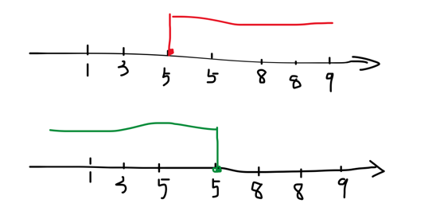

# LC34 Find First and Last Position of Element in Sorted Array (mid)
- Binary Search的典型应用
- 区间问题

## 问题描述
```yaml
Given an array of integers nums sorted in non-decreasing order, find the starting and ending position of a given target value.

If target is not found in the array, return [-1, -1].

You must write an algorithm with O(log n) runtime complexity.
```
### Input and Output
```text
Example 1:
Input: nums = [5,7,7,8,8,10], target = 8
Output: [3,4]

Example 2:
Input: nums = [5,7,7,8,8,10], target = 6
Output: [-1,-1]

Example 3: # 数组为空
Input: nums = [], target = 0
Output: [-1,-1]

Example 4: # 要找的数字不重复，首尾相同
Input: nums = [1], target = 1
Output: [0,0]

```

## 分析
这题是二分查找左右区间的典型例题。对于这个题目，对nums数组进行两次二分查找，分别找左边界和右边界。


**注意点**：
- 数组有序，非降序，代表可能会重复，也可能不会
- 注意空数组的处理
- 数组长度在[0,10^5]
- 数组内容在[-10^9, 10^9]
- 时间复杂度要O(log n)

## 题解
```java
    // 1,3,5,5,6,8
    public static int[] searchRange(int[] nums, int target) {
        // 数组可能为空
        if(nums==null || nums.length == 0) return new int[]{-1,-1};

        int left = 0, right = nums.length - 1;
        // 找左区间的右边界，左区间<target
        while (left < right) {
            int mid = left + right + 1 >> 1;
            if (nums[mid] <= target) left = mid;
            else right = mid - 1;
        }

        int j = nums[left] == target ? left : -1;
        if (j == -1) return new int[]{-1, -1};

        // 找右区间的左边界, 右区间 > target
        left = 0;
        right = nums.length - 1;

        while (left < right) {
            int mid = left + right >> 1;
            if (nums[mid] >= target) right = mid;
            else left = mid + 1;
        }
        int i = nums[left] == target ? left : -1;
        return new int[]{i, j};
    }
```
- 时间复杂度O(logn)
- 空间复杂度O(1)