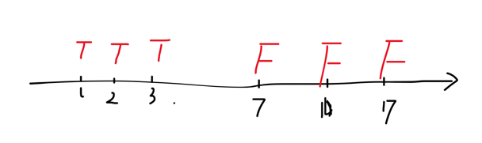

# Binary Search
## 概述
二分查找是数据结构算法中重要的查找算法，最通常的应用场景，常用于在有序数组
中查找某个元素，确定区间的边界问题。

二分查找操作的精髓在于，设计一个check条件，每次能排除数组一半元素，这样查找
的范围规模就会每次减少一半。算法的时间复杂度在O(logN)。

二分法的变体，是基于check条件，每次能排除数组左边或者右边一半元素即可，所以并非
要求数组严格有序。比如一些算法题中，数组可能是部分rotate的，像[1,2,3,5,8] -> [3,5,8,1,2]，
由在index为2的位置旋转得到，导致原来的有序数组，变成了两部分升序序列。

## 模板
二分搜索最直接的任务是，在一个有序数组中，查找某个特定元素。基本思想是，设计一个left指针和right
指针，在搜索最初的时候，这两个指针对应了总的搜索范围。接下来的模板，就是在一个while(left<right)的
循环中，设计一套逻辑，逐渐逼近我们的目标值target。

将简单任务延伸，可以拓展为**区间问题**。对于任意一个数组，设计一个返回布尔值的check()条件，
这个check()条件能将数组分为左右互斥的两部分，比如，左区间全部为true, 右边区间全部为false。
### 关于check的理解
理解check()函数对二分解题非常重要，可以说是解题的关键所在。我们以 _Leetcode 278. First Bad Version_ 为例
进行说明。
```yaml
Suppose you have n versions [1, 2, ..., n] and you want to find out the first bad one, 
which causes all the following ones to be bad.

You are given an API bool isBadVersion(version) 
which returns whether version is bad. Implement a function to find the first bad version. 
You should minimize the number of calls to the API.

解释：
给一个n, 代表了[1,2,3,...,n]这些version, 如果i version是坏的，那么i之后的所有version都是坏的，你需要
用尽可能少的次数找到第一个坏掉的version.
题目提供了bool isBadVersion(version)这个API，判断某个version的好坏。
```
这题的isBadVersion(version)就是天然的check(x)。在下面这个草图中，这个check()条件将数组分为左右互斥的两部分，二分查找解决的就是实际上就是区间问题：
- 右边区间的左边界(7) or
- 左边区间的有边界(3)



对check函数有了初步的理解以后就可以引入二分查找的两个模板了：
```java
    // 1.查找左区间的右边端点
    public int binarySearch(int[] nums) {
        // 搜索的上下界限
        int left = 0, right = nums.length -1;
        // 这里设置为left < right, 当退出循环时候,left一定和right相等
        while(left < right) {
            // 这里需要注意溢出
            int mid = left + right + 1 >> 1;
            // int mid = left + (right - left + 1) / 2; 这种写法不会溢出
            if(check(nums[mid])) {
                // check在左边区间全部满足，在左区间上找
                left = mid;
            } else {
                right = mid - 1;
            }
        }
        return check(left) ? left: -1; // 返回的时候check一下是不是真的查询到了
    }

    // 2.查找右区间的左端点
    public int binarySearch(int[] nums) {
        // 搜索的上下界限
        int left = 0, right = nums.length -1;
        while(left < right) {
            // 这里需要注意溢出
            int mid = left + right >> 1;
            // int mid = left + (right - left) / 2; 这种写法不会溢出
            if(check(nums[mid])) {
                // 右边区间全部满足, 在右区间上找
                right = mid;
            } else {
                left = mid + 1;
            }
        }
        return check(left) ? left: -1;
    }
```
  
值得注意的是，很多时候check()的设计并不是那么明显，有的时候脑子需要转个弯，比如你可能需要利用下标的位置关系，需要利用数组的开始或者末尾元素等等。
这些需要在后序的做题中再总结设计的巧思。

## 应用分类
常见的二分查找可分为以下几类常见题型：
- 旋转数组区间问题
- 区间左右边界问题

### 区间左右边界问题
| Title                                                        | Key words                   | Level | Familiar Score |
|--------------------------------------------------------------|-----------------------------|-------|----------------|
| LC34 Find First and Last Position of Element in Sorted Array | sorted, duplicate           | mid   | 85             |
| LC35 Search Insert Position                                  | distinct, ascending, sorted | easy  | 100            |
| LC69 Sqrt(x)                                                 | sqrt                        | easy  | 100            |
| **LC275 H-Index II**                                         | sorted                      | mid   | 40             |
| LC 278 First Bad Version                                     |                             | easy  | 100            |
| LC 436 Find Right Interval                                   | sorted, interval            | mid   | 75             |
| **LC 475 Heaters**                                           |                             | mid   | 80             |


==============
### 固定某个元素的二分查找
268
167
532

### 旋转数组查找问题
lc33， lc81 (查找某个数)


### 区间最大值最小值问题
lc153 旋转数组找最小值 154
162

### 寻找边界问题
611

### 二维数组查找问题
- 74
- 240
378 二维数组第k小问题

### 下标关系
287
540

### 最长递增子序列问题

### 其他
222
349
350

456 treemap 单调栈
475

### 组数剩余问题
前缀和 441
分组查找问题 400
前缀和 209，497， 528
611


