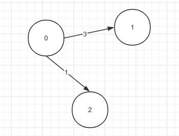

# Graph Algorithms
Graph Data Structure is a collection of nodes(V) and edges(E). The graph is denoted by G(V,E).

## Graph Template
There are multiple ways to store a graph. For convenience, define a graph structure and transfer the diverse input into a common format graph structure.

### Node
```java
public class Node {
    public int value;
    public int in;  // in degree
    public int out;  // out degree
    
    public List<Node> next;  // neighbor nodes
    public List<Edge> edge;
    
    public Node(int val) {
        value = val;
        in = 0;
        out = 0;
        next = new ArrayList<>();
        edge = new ArrayList<>();
    }
}
```
### Edge
```java
public class Edge {
    public Node from;
    public Node to;
    public int weight;
    
    public Edge(Node from, Node to, int weight) {
        this.from = from;
        this.to = to;
        this.weight = weight;
    }
}
```

### Graph
```java
public class Graph {
    public HashMap<Integer, Node> nodes;
    public HashSet<Edge> edges;
    
    public Graph() {
        nodes = new HashMap<>();
        edges = new HashSet<>();
    }
    
    
}
```

### GraphGenerator
Define a GraphGenerator tool class to transfer diverse input into a graph.

For example, input is a n-3 matrix:
```aidl
[
    [0, 1, 3],
    [0, 2, 1]
]
```


```java
public static Graph createGraphWithEdgeFromTo(Integer[][] matrix) {
        Graph graph = new Graph();

        for(int i=0;i<matrix.length;i++) {
            int from = matrix[i][0];  // from node index
            int to = matrix[i][1];    // to node index
            int w = matrix[i][2];

            if(!graph.nodes.containsKey(from)) {
                graph.nodes.put(from, new Node(from));
            }

            if(!graph.nodes.containsKey(to)) {
                graph.nodes.put(to, new Node(to));
            }

            // construct edge
            Node fromNode = graph.nodes.get(from);
            Node toNode = graph.nodes.get(to);
            Edge edge = new Edge(fromNode, toNode, w);

            fromNode.next.add(toNode);
            fromNode.edge.add(edge);

            fromNode.out++;
            toNode.in++;

            graph.edges.add(edge);
        }
        return graph;
    }
```

## BFS and DFS in Graph
Create the graph using GraphGenerator. The BFS and DFS algorithms are based on the defined structure.
### BFS
- BFS relies on a queue to support FIFO.
- Use a HashSet<Node> visited to record visited nodes. Nodes which are already been visited should not add in queue.
- After offer, do the visited operation immediately.
```java
public static void BFS(Node node) {
    if(node == null) return;

    Deque<Node> queue = new ArrayDeque<>();
    HashSet<Node> visited = new HashSet<>();

    queue.offer(node);
    visited.add(node);

    while(!queue.isEmpty()) {
        Node p = queue.pollFirst();
        System.out.print(p.value+" ");   // print after pop

        for(Node neighbor: p.next) {
            if(!visited.contains(neighbor)) {
                queue.offer(neighbor);
                visited.add(neighbor);
            }
        }
    }
}
```

### DFS
- Use a stack to maintain the traverse path.
- Use a HashSet<Node> visited to record the visited nodes.
- Find one neighbor not visit, and then break.
- When push, always push the parent first, and then the unvisited child.(Push twice)
```aidl
public static void DFS(Node node) {
    Stack<Node> stack = new Stack<>();
    HashSet<Node> visited = new HashSet<>();
    
    stack.push(node);
    visited.add(node);
    System.out.print(node.value+" ");
    
    while(!stack.isEmpty()) {
        Node cur = stack.pop();
        
        for(Node neighbor: cur.next) {
        
        // If there are unvisited neighbor, find one and break
            if(!visited.contains(neighbor)) {
                stack.push(cur);
                stack.push(neighbor);
                System.out.print(node.value+" ");
                visited.add(neighbor);
                break;
            }
        }
    }
}
```

## TopologySort
Topology sort is used in determining cycle existence in graph. If there is cycle in graph, the topology sort can not reach every node in the graph.
Topology sort can also determine sequences with dependencies.

**Process**:
- Find a in degree equal to 0 node.
- Remove the node from the graph, update the remaining in/out degree.
- Find a in degree equal to 0 node again...

To support the above process, need:

- HashMap<Node, Integer> inMap
```
An in degree map, store all nodes' in degree. 
```
- Deque<Node> zeroNodes
```
A queue contains all zero in degree nodes.
```

```java
public static List<Node> topologySort(Graph graph) {
    HashMap<Node, Integer> inMap = new HashMap<>();  // node - in degree
    Deque<Node> zeroNodes = new LinkedList<>();  // zero in degree node
    List<Node> result = new LinkedList<>();

    // add all nodes in map
    for(Node node: graph.nodes.values()) {
        inMap.put(node, node.in);
        if(inMap.get(node) == 0) {
            zeroNodes.offer(node);  // if in degree = 0, add to zero nodes queue
        }
    }

    while(!zeroNodes.isEmpty()) {
        Node cur = zeroNodes.pollFirst();
        result.add(cur);
        for(Node neighbor: cur.next) {
            inMap.put(neighbor, inMap.get(neighbor) - 1);
            if (inMap.get(neighbor) == 0) {
                zeroNodes.offer(neighbor);
            }
        }
    }
    return result;
}
```

## Cycles in Graph
Two fundamental methods to detect cycle in graph.
- DFS
  ```
   Maintain the current path in stack. If dfs meet a node is already in the current path, suggests there is a cycle.
  ```
- Topological Sorting
   ```aidl
   If the topology sort can't remove all the nodes, suggests there is a cycle.
   ```
  
## Shortest Path in Graph
### Dijkstra
Given a weighted graph and a source vertex in the graph, find the shortest paths from the source to all the other vertices in the given graph.

**Note:** The given graph does not contain any negative edge.

- HashMap<Node, Integer> distanceMap
  - maintain **Node from** to other node's distance
- HashSet<Node> selectedNodes
  - maintain selected nodes, these nodes can't be chosen twice
    
```java
/**
     * Dijskra
     * */
    public static HashMap<Node, Integer> dijskra(Node from) {
        HashMap<Node, Integer> distanceMap = new HashMap<>();
        HashSet<Node> selectedNodes = new HashSet<>();

        distanceMap.put(from, 0);

        // getMinDistanceFromUnselectedNodes
        Node minNode = getMinDistanceFromUnselectedNodes(distanceMap, selectedNodes); // 跳转点

        while(minNode!=null) {
            int distance = distanceMap.get(minNode); // 到跳转点的距离

            for(Edge edge: minNode.edge) {
                Node to = edge.to;
                if(!distanceMap.containsKey(to)) {
                    distanceMap.put(to, distance+edge.weight);
                } else {
                    distanceMap.put(to, Math.min(distanceMap.get(to), distance+ edge.weight));  // distanceMap中已经有该记录
                }
            }
            selectedNodes.add(minNode);
            minNode = getMinDistanceFromUnselectedNodes(distanceMap, selectedNodes);
        }
        return distanceMap;
    }

    /**
     * Find min distance node in distance map.
     * */
    public static Node getMinDistanceFromUnselectedNodes(HashMap<Node, Integer> distanceMap,
                                                          HashSet<Node> selectedNodes) {
        Node minNode = null;
        int minDistance = Integer.MAX_VALUE;

        for(Node node: distanceMap.keySet()) {
            if(!selectedNodes.contains(node) && distanceMap.get(node) < minDistance) {
                minDistance = distanceMap.get(node);
                minNode = node;
            }
        }

        return minNode;
    }
```

**Reference**

https://www.geeksforgeeks.org/graph-data-structure-and-algorithms/